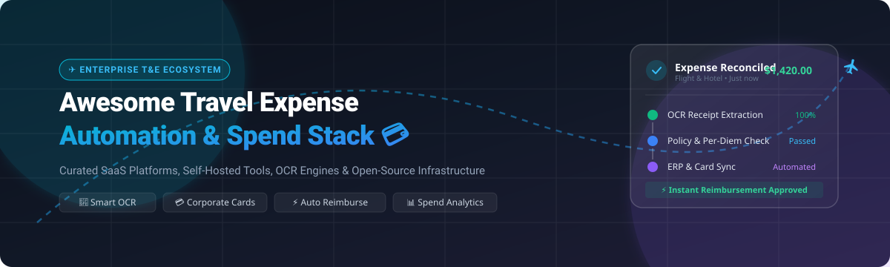

# ✈️ Awesome Travel Expense Automation 💳

<div align="center">

<a href="https://github.com/ishandutta2007/Awesome-Awesome-Awesome"></a>
<a href="https://discord.gg/jc4xtF58Ve"></a>
<a href="https://github.com/ishandutta2007/Awesome-Travel-Expense-Automation/stargazers"></a>
<a href="https://github.com/ishandutta2007/Awesome-Travel-Expense-Automation/network/members"></a>
<a href="https://github.com/ishandutta2007/Awesome-Travel-Expense-Automation/issues"></a>
<a href="https://github.com/ishandutta2007/Awesome-Travel-Expense-Automation/blob/main/LICENSE"></a>
<a href="https://github.com/ishandutta2007"></a>

<br/><br/>



<br/><br/>

**A curated index of enterprise SaaS platforms, open-source repositories, self-hosted expense trackers, AI receipt OCR tools, and corporate spend-management infrastructure.**

[🌟 Explore SaaS](#-saashosted-platforms) • [💻 Open-Source Repos](#-open-source-github-projects) • [🏗️ Build Custom Stack](#%EF%B8%8F-building-a-custom-open-source-expense-automation-stack) • [🤝 Contributing](#-how-to-contribute) • [📈 Star History](#-star-history)

</div>

---

## 📖 Overview & Ecosystem Guide

Managing business travel, employee per-diems, receipt scanning, and expense reimbursement is a core operational challenge for modern organizations. This repository categorizes top-tier commercial **SaaS platforms** alongside extensible **open-source projects** and building blocks for **Travel & Expense (T&E) Automation**.

### 🔑 Key Automation Domains Covered:
- 🧾 **Smart Receipt Processing & AI OCR**: Automatic data extraction for merchants, line items, taxes, and multi-currency transactions.
- 💳 **Corporate Cards & Spend Controls**: Real-time spend limits, auto-locking cards, virtual cards, and instant transaction categorization.
- ✈️ **Travel Booking & Policy Enforcement**: Out-of-policy warnings, automated per-diem calculations, flight/hotel aggregation, and approval workflows.
- ⚡ **Instant Reimbursements & ACH**: Automated direct deposits, batch approvals, and employee payout tracking.
- 📊 **Accounting & ERP Synchronization**: Native two-way integrations with ERPNext, QuickBooks, Xero, NetSuite, Sage, and SAP.

---

## 📑 Table of Contents

- [🏢 SaaS/Hosted Platforms](#-saashosted-platforms)
  - [👑 Category Leaders](#-category-leaders)
  - [🌐 Additional Notable SaaS Platforms](#-additional-notable-saas-platforms)
- [💻 Open-Source GitHub Projects](#-open-source-github-projects)
  - [🏢 Enterprise & Small-Business Expense Management](#-enterprise--small-business-expense-management)
  - [🏠 Self-Hosted Personal & Team Expense Trackers](#-self-hosted-personal--team-expense-trackers)
  - [🧾 Receipt Processing & Document OCR Engines](#-receipt-processing--document-ocr-engines)
  - [👥 Travel Splitting & Group Expense Building Blocks](#-travel-splitting--group-expense-building-blocks)
  - [🔄 Workflow Orchestration & Data Integration](#-workflow-orchestration--data-integration)
- [🏗️ Building a Custom Open-Source Expense Automation Stack](#%EF%B8%8F-building-a-custom-open-source-expense-automation-stack)
- [🤝 How to Contribute](#-how-to-contribute)
- [📈 Star History](#-star-history)
- [⚖️ Disclaimer](#%EF%B8%8F-disclaimer)

---

## 🏢 SaaS/Hosted Platforms

### 👑 Category Leaders
*Ranked descending by Company Valuation / Enterprise Market Capitalization:*

| Platform | Company Valuation / Revenue Size | Description | Starting Pricing | Free Tier / Free Trial Limits |
| :--- | :--- | :--- | :--- | :--- |
| **[SAP Concur](https://www.concur.com/)** | **~$230B Market Cap** *(SAP SE)* | 🌐 Enterprise travel and expense management platform covering travel booking, expense reporting, receipt capture, approvals, reimbursement, and ERP integrations. | Starts at ~$9/user/month (or ~$7/report for Standard Base tier; enterprise plans by quote) | 15-day free trial (full access to receipt capture, expense reporting, and basic configurations; no credit card required) |
| **[Ramp](https://ramp.com/)** | **$44B Valuation** *(June 2026 Series F)* | 💳 Spend-management platform combining corporate cards, expense management, travel, accounts payable, approvals, and automated financial controls. | Free tier available; paid Ramp Plus starts at $15/user/month (billed monthly) / $12/user/month (billed annually) | Free for ever (unlimited cards, basic expense management, receipt capture, bill pay, and standard accounting integrations) |
| **[Brex](https://www.brex.com/)** | **$5.15B Acquisition** *(Capital One 2026)* | 🏦 Corporate spend platform combining cards, expense management, travel, reimbursements, procurement, and financial controls. | Free tier available; paid Brex Premium starts at $12/user/month | Free for ever (Essentials plan: $0/user/month for corporate cards, expense reimbursements, travel booking, and standard accounting integrations; requires US-registered entity) |
| **[Navan Expense](https://navan.com/)** | **$7.03B Valuation / Public Market Cap** | ✈️ Integrated travel and expense platform combining business travel, expense reporting, corporate cards, reimbursements, policy controls, and travel analytics. | Free for first 5 users; starts at $15/active user/month thereafter | Free for ever for up to 5 monthly active expensing users (full receipt scanning, corporate card issuance, and automated approvals) |
| **[Emburse](https://www.emburse.com/)** | **~$1B+ Valuation** *(Est. ~$200M ARR)* | 💼 Expense-management ecosystem providing expense capture, receipt automation, corporate cards, travel management, approvals, reimbursement, and spend analytics. | Emburse Spend starts at $8/user/month ($7/user/month billed annually); Emburse Professional (Certify) starts at ~$12/user/month | 30-day free trial on Emburse Spend; 14-day free trial on Emburse Professional (Certify) |
| **[Pleo](https://www.pleo.io/)** | **$4.7B Valuation** *(Fintech Unicorn)* | 🇪🇺 European spend-management platform providing employee cards, expense management, receipt capture, reimbursements, approvals, and accounting integrations. | Free tier available; Essential plan starts at £39/month (up to 3 users, +£11.50/extra user/month) | Free for ever for up to 5 users (includes physical & virtual cards, automated expense capture, and basic accounting integrations) |
| **[Zoho Expense](https://www.zoho.com/expense/)** | **~$1B+ ARR** *(Zoho Corporation Bootstrapped)* | ☁️ Cloud expense-management platform supporting receipt scanning, travel expenses, mileage, approvals, reimbursements, corporate cards, and policy enforcement. | Free tier available; Standard plan starts at $3/user/month ($2.40/user/month billed annually; min 3 users); Premium plan at $5/user/month | Free for ever for up to 3 users (includes 20 receipt autoscans/month total, expense tracking, mileage, and 5GB receipt storage) |
| **[Expensify](https://www.expensify.com/)** | **~$150M Market Cap** *(Nasdaq: EXFY)* | 🧾 Automated expense-management platform supporting receipt scanning, expense reports, reimbursements, corporate cards, approvals, and accounting integrations. | Free for individuals; Collect plan starts at $5/user/month (with Expensify Card) / $10/user/month (without card); Control plan starts at $9/user/month | Free for ever for individual tracking (unlimited receipt SmartScans, expense tracking, and mileage) or 6-week free trial for team workspaces |
| **[Moss](https://www.getmoss.com/)** | **~$570M Valuation** *(Series B)* | 🛡️ Spend-management platform combining corporate cards, expense management, invoices, reimbursements, approval workflows, and financial controls. | Free tier available; Pro plan starts at €99/month + €10/user/month | Free for ever for up to 3 users (unlimited corporate cards, up to 20 invoices/month, receipt capture, and basic approval workflows) |
| **[Soldo](https://www.soldo.com/)** | **~$400M Valuation** *(Series C)* | 💳 Prepaid corporate-card and spend-management platform with expense tracking, controls, receipt capture, budgets, and accounting integrations. | Standard plan starts at £21/month (for up to 3 users; +£7/extra user/month); Plus plan starts at £33/month | 30-day free trial on Standard and Plus plans (full access to prepaid cards, app expense capture, and reporting) |

---

### 🌐 Additional Notable SaaS Platforms
*Ranked descending by Company Valuation / Enterprise Market Capitalization:*

| Platform | Company Valuation / Revenue Size | Description | Starting Pricing | Free Tier / Free Trial Limits |
| :--- | :--- | :--- | :--- | :--- |
| **[Microsoft Dynamics 365 Expense Management](https://www.microsoft.com/dynamics-365)** | **~$3.59T Market Cap** *(Microsoft Corp)* | 🏢 Expense-management capabilities natively integrated with Microsoft's enterprise ERP, Finance, and Project Operations ecosystem. | Starts at $210/user/month for Dynamics 365 Finance (or $30/user/month attach license for existing base users) | 30-day free trial (includes access to Dynamics 365 Finance sandbox environment, sample expense workflows, and OCR receipt capture) |
| **[Oracle Fusion Cloud Expenses](https://www.oracle.com/applications/erp/expenses/)** | **~$415B Market Cap** *(Oracle Corp)* | 🏛️ Enterprise expense-management capabilities integrated with Oracle's financial and global ERP ecosystem. | Starts at ~$280/user/month for Oracle Cloud Financials base subscription (or custom quote for Self-Service Expenses add-on) | 30-day free trial with $300 in Oracle Cloud Free Tier credits to explore cloud applications and infrastructure |
| **[Workday Expenses](https://www.workday.com/)** | **~$65B Market Cap** *(Nasdaq: WDAY)* | 👔 Enterprise expense-management capabilities integrated with Workday's financial-management and human-capital ecosystem. | Starts at ~$150–$300/employee/year (annual contract, typically minimum $10,000–$25,000/year contract value) | 30-day free trial / sandbox demonstration access upon enterprise sales qualification |
| **[American Express Global Business Travel](https://www.amexglobalbusinesstravel.com/)** | **~$3.5B Market Cap** *(NYSE: GBTG)* | 🛫 Enterprise travel-management platform providing corporate travel booking, expense-related services, reporting, and travel program management. | Custom enterprise fee schedule (typically starts at ~$10–$25 per offline/online booking transaction fee) | No free tier; 30-day pilot / proof-of-concept program available upon enterprise sales qualification |
| **[Divvy](https://getdivvy.com/)** | **~$3.5B Valuation** *(Acquired by BILL)* | 📊 Corporate-card and spend-management platform combining budgets, cards, expense management, and accounting workflows. | Free platform ($0/user/month; now BILL Spend & Expense, monetized via card interchange fees) | Free for ever (unlimited physical & virtual cards, unlimited expense reports, budget controls, and accounting sync) |
| **[Coupa](https://www.coupa.com/)** | **~$8B Acquisition** *(Thoma Bravo)* | 🔄 Business spend-management platform covering procurement, expenses, payments, travel, supplier management, and spend analytics. | Custom enterprise subscription (typically starts at ~$2,500/month or ~$15/user/month for mid-market expense modules) | Free for ever on Coupa Supplier Portal (unlimited e-invoicing & PO tracking for vendors); 30-day trial for Coupa Advanced add-ons |
| **[Navan](https://navan.com/)** | **$7.03B Valuation / Market Cap** | 🧳 Integrated business travel and expense platform combining travel booking, payments, expense reporting, and corporate spend management. | Free travel platform for teams up to 300 employees; expense add-on starts at $15/user/month after first 5 free users | Free for ever travel booking software for companies with up to 300 employees (plus 5 free monthly expensing users) |
| **[TravelPerk](https://www.travelperk.com/)** | **$1.4B Valuation** *(Travel Unicorn)* | 🗺️ Business travel platform providing travel booking, expense-related workflows, travel policy management, reporting, and corporate travel administration. | Free Starter tier; Premium plan starts at $99/month + 3% per booking; Pro plan at $299/month | Free for ever (Starter plan: up to 5 travel bookings/month, 100% automated travel policy enforcement, and basic expense reports) |
| **[Ramp Travel](https://ramp.com/travel)** | **$44B Valuation** *(Part of Ramp)* | ✈️ Business travel and spend-management solution integrated with corporate cards, expense automation, travel policies, and spend controls. | Included free in Ramp core platform ($0/user/month); Ramp Plus is $15/user/month | Free for ever within the core Ramp platform (unlimited travel bookings, automated receipt reconciliation, and corporate card controls) |
| **[Spendesk](https://www.spendesk.com/)** | **~$1.5B Valuation** *(Fintech Unicorn)* | 💳 Spend-management platform providing corporate cards, virtual cards, expense management, invoice workflows, approvals, and financial controls. | Starter/Growth plans start at ~$120/month (£95/month) base fee; customized by entity & transaction volume | 14-day free trial / guided proof of concept with sample expense reports, virtual cards, and invoice approvals |
| **[Payhawk](https://payhawk.com/)** | **$1B Valuation** *(Fintech Unicorn)* | 💱 Spend-management platform combining corporate cards, expense management, accounts payable, procurement, approvals, and accounting automation. | Growth plan starts at £149/month (or $199/month) for Cards & Expenses; Enterprise plans by quote | 7-day free trial / sandbox account with virtual test cards, OCR receipt scanning, and approval workflow setup |
| **[Airbase](https://www.airbase.com/)** | **~$600M Valuation** *(Acquired by Paylocity)* | 📑 Spend-management platform covering corporate cards, expense management, accounts payable, approvals, procurement, and accounting workflows. | Free tier available (Essentials); Growth/Enterprise packages start at ~$400/month (custom-quoted) | Free for ever (Essentials plan for early-stage companies: corporate cards, bill pay, reimbursement workflows, and standard integrations) |
| **[Clara](https://www.clara.com/)** | **~$500M Valuation** *(LATAM Spend Unicorn)* | 🌎 Corporate spend-management platform providing cards, expense management, controls, and financial workflows for businesses. | Free tier available; Pro plan starts at ~$12/user/month (or local currency equivalent in LATAM/global markets) | Free for ever for up to 5 users and 1 company entity (includes AI OCR receipt capture, WhatsApp submission, and corporate cards) |
| **[Jeeves](https://www.jeeves.com/)** | **~$500M Valuation** *(Global Spend Platform)* | 🌍 Global corporate spend platform combining cards, expense management, payments, reimbursements, and financial controls. | Free tier available; Enterprise/Global tiers custom-priced | Free for ever (Basic plan for up to 10 users: unlimited physical/virtual corporate cards, zero FX fees, and expense management) |
| **[Corpay](https://www.corpay.com/)** | **~$24B Market Cap** *(NYSE: CPAY)* | ⛽ Corporate payments and expense-management ecosystem covering cards, travel payments, fleet expenses, and business spend. | Corpay One plans start at $9/user/month (or transaction-based card spend pricing) | 14-day free trial on Corpay One (includes automated receipt extraction, bill pay, and accounting synchronization) |
| **[Certify](https://www.certify.com/)** | **~$250M Business Unit** *(Emburse Ecosystem)* | 📝 Expense-management platform providing receipt capture, expense reports, approvals, reimbursement, and travel-expense workflows. | Certify Now starts at $12/user/month (monthly subscription for 1–25 employees); custom quotes for Enterprise | 14-day free trial (full access to automated receipt scanning, report creation, mobile app, and approval flows) |
| **[Abacus](https://www.abacus.com/)** | **~$100M Business Unit** *(Emburse Ecosystem)* | ⚡ Corporate expense-management platform focused on real-time expense reporting, approvals, reimbursements, and spend controls. | Starter plan starts at $9/active user/month ($8/user/month billed annually; min 2 users); Pro plan at $12/user/month | 14-day free trial (real-time expense submission, policy rules, receipt OCR, and automated next-day ACH reimbursements) |
| **[Rydoo](https://www.rydoo.com/)** | **~$80M Valuation** *(Marlin Equity Partners)* | 📱 Expense-management platform focused on receipt capture, expense reporting, approvals, mileage, travel expenses, and accounting integrations. | Essentials plan starts at $10/user/month ($8/user/month billed annually; min 5 users); Pro plan at $12/user/month | 14-day free trial (unlimited OCR receipt scanning, approval workflows, mileage tracking, and ERP integration test) |
| **[Fyle](https://www.fylehq.com/)** | **~$50M Valuation** *(Sage Partnership)* | ✉️ Expense-management platform with receipt capture, corporate cards, expense reporting, approvals, reimbursements, and accounting integrations. | Growth plan starts at $11.99/active user/month ($8.99/active user/month billed annually; min 5 users); Business plan at $14.99/user/month | 60-day free trial (unlimited receipt tracking via Slack, Teams, SMS, and Gmail, credit card feeds, and accounting sync) |
| **[Center](https://www.getcenter.com/)** | **~$40M Raised** *(Venture Backed)* | 🎯 Corporate-card and expense-management platform combining employee spending, receipt capture, expense reports, and automated accounting workflows. | Card-connected software starts at $0 base with CenterCard (custom-quoted platform fee for standalone software: ~$8/user/month) | 30-day pilot / sandbox evaluation program upon request (includes card issuance and receipt tracking) |
| **[Webexpenses](https://www.webexpenses.com/)** | **~$25M Revenue** *(ELMO Software)* | 💻 Cloud expense-management software covering receipt capture, expense reports, approvals, reimbursements, mileage, and accounting integration. | Starts at ~$10/active user/month (or £6/active user/month; pay only for active monthly submitters) | 14-day free trial / interactive sandbox demo with sample receipt upload and report generation |
| **[ExpensePoint](https://www.expensepoint.com/)** | **Bootstrapped Profitable** | 📍 Expense reporting platform supporting receipt processing, approvals, policy enforcement, mileage, reimbursements, and reporting. | Starts at $9.00/active user/month ($8.50/user/month billed annually; unlimited report submissions) | 30-day free trial (includes full receipt reader OCR, report builder, multi-currency conversion, and approval routing) |
| **[ExpenseOnDemand](https://www.expenseondemand.com/)** | **Bootstrapped Profitable** | ⏱️ Cloud expense-management system providing expense reporting, receipt capture, approvals, mileage tracking, and reimbursement workflows. | Pay-as-you-use modular pricing starting at ~$7/active user/month (£4.90/user/month) based on selected feature modules | 30-day free trial (full access to chosen add-on modules, receipt scanning, approval chains, and currency converters) |

---

## 💻 Open-Source GitHub Projects

Each open-source repository below is equipped with a real-time GitHub stargazer social badge that directly links to its stargazers page. Sorted by star counts in descending order within each domain.

### 🏢 Enterprise & Small-Business Expense Management

- **[ERPNext](https://github.com/frappe/erpnext)** [](https://github.com/frappe/erpnext/stargazers)  
  Full-scale open-source ERP system featuring double-entry accounting, employee expense claims, travel advance requests, purchase orders, approval matrixes, and payroll reimbursement integration.

- **[New Expensify](https://github.com/Expensify/App)** [](https://github.com/Expensify/App/stargazers)  
  Modern, open-source multi-platform financial collaboration and expense management application. Features chat-based expense submission, real-time receipt scanning, distance tracking, and payment integrations.

- **[Invoice Ninja](https://github.com/invoiceninja/invoiceninja)** [](https://github.com/invoiceninja/invoiceninja/stargazers)  
  Comprehensive invoicing, expense tracking, and client billing application. Automates pass-through expense billing, receipt attachments, vendor management, and multi-currency conversions.

- **[Akaunting](https://github.com/akaunting/akaunting)** [](https://github.com/akaunting/akaunting/stargazers)  
  Modular open-source accounting and business spend platform. Handles expense categorization, recurring bills, vendor management, receipt attachments, and financial reporting.

- **[Dolibarr](https://github.com/Dolibarr/dolibarr)** [](https://github.com/Dolibarr/dolibarr/stargazers)  
  Established open-source ERP/CRM suite with built-in employee expense reports (notes de frais), travel mileage recording, multi-level validation chains, and supplier ledger integration.

- **[Frappe Framework](https://github.com/frappe/frappe)** [](https://github.com/frappe/frappe/stargazers)  
  Python and JavaScript full-stack web application framework powering ERPNext. Ideal for creating custom expense approval engines, policy validation workflows, and internal financial portals.

- **[Frappe Books](https://github.com/frappe/books)** [](https://github.com/frappe/books/stargazers)  
  Free desktop-based double-entry accounting application for small businesses, freelancers, and entrepreneurs to manage bills, payments, and operational expenses.

- **[ERPNext Expenses](https://github.com/kid1194/erpnext_expenses)** [](https://github.com/kid1194/erpnext_expenses/stargazers)  
  Specialized ERPNext extension module providing custom expense categories, advance requests, employee attachment workflows, and automated general-ledger postings.

---

### 🏠 Self-Hosted Personal & Team Expense Trackers

- **[Maybe](https://github.com/maybe-finance/maybe)** [](https://github.com/maybe-finance/maybe/stargazers)  
  Modern open-source personal finance and wealth tracker with transaction syncing, spend categorization, and financial analytics.

- **[Actual Budget](https://github.com/actualbudget/actual)** [](https://github.com/actualbudget/actual/stargazers)  
  Local-first, privacy-focused open-source financial management application built on zero-based envelope budgeting principles with automatic bank transaction synchronization.

- **[Firefly III](https://github.com/firefly-iii/firefly-iii)** [](https://github.com/firefly-iii/firefly-iii/stargazers)  
  Full-featured self-hosted manager for personal and small team finances supporting double-entry bookkeeping, rule-based automation, expense categorization, and budgets.

- **[Money Manager Ex](https://github.com/moneymanagerex/moneymanagerex)** [](https://github.com/moneymanagerex/moneymanagerex/stargazers)  
  Cross-platform, easy-to-use personal finance software for tracking expenses, bank accounts, receipts, and cash flow across desktop and mobile.

- **[ExpenseOwl](https://github.com/tanq16/expenseowl)** [](https://github.com/tanq16/expenseowl/stargazers)  
  Lightweight self-hosted expense tracking tool designed for rapid manual and recurring expense capture, categorical budgeting, and visualization.

- **[Gullak](https://github.com/mr-karan/gullak)** [](https://github.com/mr-karan/gullak/stargazers)  
  AI-enabled, natural-language expense tracker supporting quick entry, automatic multi-currency conversion, categorization, and CSV export.

- **[Expensave](https://github.com/algirdasc/expensave)** [](https://github.com/algirdasc/expensave/stargazers)  
  Multi-user self-hosted expense tracker featuring expense calendars, bank statement imports, recurring bills, and a mobile-friendly progressive web application.

---

### 🧾 Receipt Processing & Document OCR Engines

- **[Tesseract OCR](https://github.com/tesseract-ocr/tesseract)** [](https://github.com/tesseract-ocr/tesseract/stargazers)  
  Industry-standard open-source optical character recognition engine with support for over 100 languages, widely used to extract raw text from scanned paper receipts and invoices.

- **[PaddleOCR](https://github.com/PaddlePaddle/PaddleOCR)** [](https://github.com/PaddlePaddle/PaddleOCR/stargazers)  
  Ultra-lightweight, multilingual OCR and document understanding toolkit supporting receipt parsing, layout analysis, table recognition, and key information extraction (KIE).

- **[Paperless-ngx](https://github.com/paperless-ngx/paperless-ngx)** [](https://github.com/paperless-ngx/paperless-ngx/stargazers)  
  Community-driven document management system that transforms physical receipts and travel invoices into searchable digital archives with OCR, automated tags, and machine-learning categorization.

---

### 👥 Travel Splitting & Group Expense Building Blocks

- **[ShareTab](https://github.com/sw-carlos-cristobal/sharetab)** [](https://github.com/sw-carlos-cristobal/sharetab/stargazers)  
  Self-hosted travel and shared expense manager featuring AI-powered receipt scanning, line-item allocation, multi-currency support, and optimized debt settlement algorithms.

- **[Splitwiser](https://github.com/Devasy/splitwiser)** [](https://github.com/Devasy/splitwiser/stargazers)  
  Open-source group expense splitting application providing flexible balance calculations, receipt attachments, multi-currency transactions, and settlement tracking.

---

### 🔄 Workflow Orchestration & Data Integration

- **[n8n](https://github.com/n8n-io/n8n)** [](https://github.com/n8n-io/n8n/stargazers)  
  Fair-code workflow automation platform with 400+ native nodes. Ideal for gluing receipt webhooks, OCR APIs, policy evaluation scripts, approval Slack bots, and ERP integrations.

- **[Node-RED](https://github.com/node-red/node-red)** [](https://github.com/node-red/node-red/stargazers)  
  Low-code event-driven programming tool for connecting physical IoT receipt scanners, messaging platforms, and backend financial databases.

- **[Kill Bill](https://github.com/killbill/killbill)** [](https://github.com/killbill/killbill/stargazers)  
  Open-source subscription billing, payment processing, and corporate invoicing engine for handling high-volume transaction routing and payments.

---

## 🏗️ Building a Custom Open-Source Expense Automation Stack

A production-grade, self-hosted corporate travel and expense automation system can be assembled using complementary open-source modules:

```text
                    ┌───────────────────────────┐
                    │ 📱 Employees / Travelers   │
                    │ Mobile / Web / Email / Bot │
                    └─────────────┬─────────────┘
                                  │
                     ┌────────────▼────────────┐
                     │ 📥 Expense Capture Layer │
                     │ New Expensify / ShareTab│
                     │ Actual Budget / Mobile  │
                     └────────────┬────────────┘
                                  │
                    ┌─────────────▼─────────────┐
                    │ 🧾 AI Receipt OCR Engine  │
                    │ PaddleOCR / Tesseract     │
                    │ Paperless-ngx Ingestion   │
                    └─────────────┬─────────────┘
                                  │
               ┌──────────────────┼──────────────────┐
               │                  │                  │
        ┌──────▼──────┐    ┌──────▼──────┐    ┌─────▼──────┐
        │ 🏷️ Line-Item │    │ 🛡️ Policy & │    │ 💳 Bank &   │
        │ Extraction  │    │ Per-Diem    │    │ Card Feeds │
        └──────┬──────┘    └──────┬──────┘    └─────┬──────┘
               │                  │                  │
               └──────────────────┼──────────────────┘
                                  │
                     ┌────────────▼────────────┐
                     │ ⚡ Workflow & Approvals  │
                     │ Frappe Framework / n8n   │
                     └────────────┬────────────┘
                                  │
                 ┌────────────────┼────────────────┐
                 │                │                │
          ┌──────▼──────┐  ┌──────▼──────┐  ┌─────▼──────┐
          │ 💸 Instant  │  │ 📚 General  │  │ 📊 Spend   │
          │ Payouts/ACH │  │ Ledger (ERP)│  │ Analytics  │
          │ Kill Bill   │  │ ERPNext     │  │ Grafana    │
          └─────────────┘  └─────────────┘  └────────────┘
```

### 🧩 Recommended Component Stack:
- **Frontend / Ingestion**: [New Expensify](https://github.com/Expensify/App) + Custom React Native App
- **Receipt OCR & Extraction**: [PaddleOCR](https://github.com/PaddlePaddle/PaddleOCR) / [Paperless-ngx](https://github.com/paperless-ngx/paperless-ngx)
- **Workflow & Rules Engine**: [n8n](https://github.com/n8n-io/n8n) + [Frappe Framework](https://github.com/frappe/frappe)
- **Core Ledger & Approvals**: [ERPNext](https://github.com/frappe/erpnext)
- **Object Storage & Database**: MinIO + PostgreSQL + Redis
- **Spend Intelligence & BI**: Grafana / Apache Superset

---

## 🤝 How to Contribute

We actively welcome community contributions! To suggest new tools or update existing entries:

1. 🍴 **Fork the repository**.
2. 🌿 **Create a new branch** (`git checkout -b feature/add-new-tool`).
3. 📝 **Add or update entries in `README.md`**:
   - For SaaS products, provide exact starting tier prices and explicit free tier / trial limits.
   - For Open-Source repos, include the repository URL and a live shields.io stargazer badge (`style=social&color=white`).
4. 🚀 **Commit your changes** (`git commit -m 'Add new expense automation tool'`).
5. 📤 **Push to your branch** (`git push origin feature/add-new-tool`).
6. 🔀 **Open a Pull Request** with a brief rationale.

---

## 📈 Star History

[](https://star-history.dera.page/#ishandutta2007/Awesome-Travel-Expense-Automation&type=date&legend=top-left)

---

## ⚖️ Disclaimer

*This list is curated for informational purposes. Product names, logos, and brands are property of their respective owners. Pricing, feature availability, and company valuations fluctuate over time; always confirm terms directly on the vendor's official website.*

---

<div align="center">

Made with ❤️ by the open-source finance & engineering community.  
**[Back to top ⬆️](#-awesome-travel-expense-automation-)**

</div>
